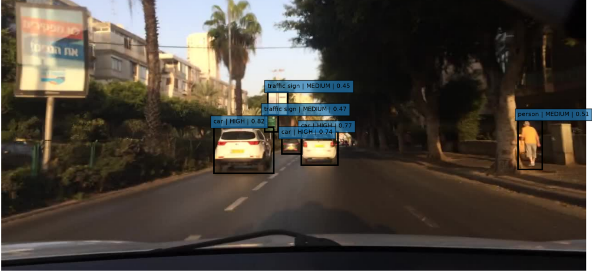

# Automotive YOLO Risk Analysis

An end-to-end computer vision project for road object detection and image-based driving risk analysis using **YOLO26s** and the **BDD100K** driving dataset.

The project covers the complete pipeline from dataset exploration and YOLO data preparation to model training, evaluation, inference, and explainable driving risk analysis.

---

## Project Overview

The main goal of this project is to detect important road objects in driving scenes and extend standard object detection with a simple and explainable risk analysis layer.

The trained YOLO26s model detects 10 road object classes:

- Car
- Truck
- Bus
- Train
- Person
- Rider
- Bike
- Motor
- Traffic Light
- Traffic Sign

After object detection, a custom image-based risk analysis layer evaluates detected objects using:

- Object type
- Position within the driving scene
- Relative bounding box size
- Detection confidence

Each detected object is assigned a numerical risk score and classified as:

**LOW · MEDIUM · HIGH**

> **Note:** The risk analysis is a simplified image-based heuristic developed for this project. It does not represent the real-world probability of a collision and is not intended to replace a production automotive safety system.

---

## Project Pipeline

The project is organized into six main stages:

1. **Dataset Exploration** — Explore BDD100K annotations, class distribution, environmental conditions, and image properties.
2. **YOLO Data Preparation** — Convert BDD100K annotations into YOLO format and validate the prepared dataset.
3. **YOLO Model Training** — Fine-tune a pretrained YOLO26s model on the BDD100K training set.
4. **Model Evaluation** — Evaluate the trained model using overall and per-class detection metrics.
5. **YOLO Inference** — Run object detection on unseen driving images and analyze predictions.
6. **Driving Risk Analysis** — Extend YOLO detections with an explainable image-based risk scoring system.

---

## Dataset

This project uses the **BDD100K (Berkeley DeepDrive)** driving dataset.

### Dataset Split

- **Training:** 70,000 images
- **Validation:** 10,000 images
- **Test:** 20,000 images
- **Image resolution:** 1280 × 720

The training set contains approximately **1.29 million annotated objects** and includes diverse driving conditions such as daytime, night, rain, snow, city streets, highways, and residential areas.

---

## Model and Training

The project uses **YOLO26s** with pretrained weights, fine-tuned on the BDD100K training dataset.

### Training Configuration

| Parameter | Value |
|---|---|
| Model | YOLO26s |
| Image Size | 512 × 512 |
| Batch Size | 2 |
| Epochs | 50 |
| Pretrained | Yes |
| AMP | Disabled |
| Training Images | 70,000 |
| Validation Images | 10,000 |

The model was trained for **50 epochs** using an **NVIDIA GeForce GTX 1650 with 4 GB VRAM**.

The best-performing weights (`best.pt`) were used for evaluation, inference, and driving risk analysis.

---

## Model Evaluation

The trained YOLO26s model was evaluated on the BDD100K validation set containing **10,000 images** and **185,526 object instances**.

### Overall Performance

| Metric | Result |
|---|---:|
| Precision | 0.678 |
| Recall | 0.426 |
| mAP@50 | 0.462 |
| mAP@50–95 | 0.256 |
| Inference Speed | 9.0 ms/image |

The model achieved particularly strong performance on the **car** class:

| Metric | Car |
|---|---:|
| Precision | 0.732 |
| Recall | 0.694 |
| mAP@50 | 0.746 |
| mAP@50–95 | 0.451 |

The evaluation also includes per-class analysis, a confusion matrix, Precision-Recall curves, and F1-Confidence analysis.

---

## Inference and Driving Risk Analysis

The best YOLO26s model was tested on unseen images from the BDD100K test set.

For each detected object, YOLO provides:

- Object class
- Bounding box coordinates
- Detection confidence

A custom risk analysis layer was then developed on top of these detections.

### Risk Analysis

The risk score combines four components:

- **Object Type** — distinguishes road users from lower-risk infrastructure
- **Position** — gives greater importance to objects within an approximate central driving risk zone
- **Relative Size** — uses bounding box size as an image-based indicator of object prominence
- **Detection Confidence** — incorporates the confidence of the YOLO prediction

The resulting score classifies each detected object into one of three levels:

**LOW · MEDIUM · HIGH**

The complete pipeline was tested on multiple unseen driving images, with risk information visualized directly on the detected objects.

> **Important:** The risk score is heuristic and based on single-image information. It does not estimate actual distance, speed, object motion, time-to-collision, or real collision probability.

### Example Risk Analysis

The following example shows YOLO detections combined with the custom driving risk analysis layer. Each detected object is displayed with its predicted class, risk level, and calculated risk score.


---

## Project Structure

The project is organized into six Jupyter notebooks:

| Notebook | Description |
|---|---|
| [01 — BDD100K Dataset Exploration](notebooks/01_BDD100K_Dataset_Exploration.ipynb) | Dataset exploration and analysis |
| [02 — YOLO Data Preparation](notebooks/02_YOLO_Data_Preparation.ipynb) | BDD100K to YOLO annotation conversion and validation |
| [03 — YOLO Training](notebooks/03_YOLO_Training.ipynb) | YOLO26s training and fine-tuning |
| [04 — YOLO Evaluation](notebooks/04_YOLO_Evaluation.ipynb) | Model evaluation and performance analysis |
| [05 — YOLO Inference](notebooks/05_YOLO_Inference.ipynb) | Inference on unseen driving images |
| [06 — Driving Risk Analysis](notebooks/06_Driving_Risk_Analysis.ipynb) | Image-based driving risk analysis |

---

## Technologies and Tools

- **Python**
- **PyTorch**
- **Ultralytics YOLO**
- **Pandas**
- **NumPy**
- **Matplotlib**
- **Jupyter Notebook**
- **CUDA**
- **Git & GitHub**

---

## How to Run

### 1. Clone the Repository

```bash
git clone https://github.com/kosar-am/Automotive-YOLO-Risk-Analysis.git
cd Automotive-YOLO-Risk-Analysis
```

### 2. Install the Required Libraries

```bash
pip install -r requirements.txt
```

### 3. Prepare the BDD100K Dataset

Download the BDD100K images and annotations and organize them according to the dataset structure used in this project.

The complete annotation conversion and validation process is documented in:

`02_YOLO_Data_Preparation.ipynb`

### 4. Run the Notebooks

The notebooks are designed to be followed sequentially:

```text
01 → Dataset Exploration
02 → Data Preparation
03 → YOLO Training
04 → Model Evaluation
05 → YOLO Inference
06 → Driving Risk Analysis
```

Start Jupyter Notebook:

```bash
jupyter notebook
```

Then open the notebooks from the `notebooks/` directory and follow them in order.

---

## Limitations and Future Improvements

The current driving risk analysis is based on single images and heuristic rules. While it provides an explainable extension to object detection, it does not model the full dynamics of a real driving environment.

### Current Limitations

- No real-world distance estimation
- No object speed or motion estimation
- No object tracking across video frames
- No lane detection or lane-aware risk analysis
- No time-to-collision estimation
- Risk scoring weights and thresholds are manually defined

### Future Improvements

Future versions of the project could extend the current pipeline with:

- Multi-object tracking across video frames
- Vehicle and pedestrian motion analysis
- Distance and depth estimation
- Lane detection
- Time-to-collision estimation
- Data-driven risk prediction instead of manually defined heuristic weights
- Real-time video-based driving risk analysis

---

## Conclusion

This project demonstrates a complete computer vision workflow for automotive scene understanding, from raw driving data to object detection and image-based risk analysis.

By combining **BDD100K**, **YOLO26s**, and a custom explainable risk analysis layer, the project goes beyond standard object detection and explores how detection results can be used for higher-level driving scene analysis.

The project also provides a foundation for future development in areas such as object tracking, depth estimation, lane understanding, motion analysis, and video-based driving risk assessment.

---

## Author

**Kosar Amini**

M.Sc. Data Science and Engineering  
Politecnico di Torino
